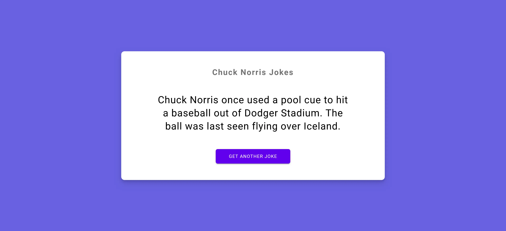

# Chuck Norris Jokes App

## Overview

This project is a simple web application that fetches random Chuck Norris jokes using the Chuck Norris Jokes API. It demonstrates the use of `XMLHttpRequest` to make API calls and display data dynamically on a web page. The app is built using HTML, CSS, and JavaScript. Though using `fetch` is the modern approach, the course I took encouraged us to learn about the XMLHttpRequest in case we come across it in older code.

## Features

- Fetches a random joke from the Chuck Norris Jokes API.
- Displays the joke on the webpage.
- Allows users to fetch a new joke by clicking a button.

## Technologies Used

- HTML
- CSS
- JavaScript (using XMLHttpRequest)

## Getting Started

### Prerequisites

Make sure you have a modern web browser to run the application.

### Installation

1. Clone the repository or download the ZIP file.
2. Open `index.html` in your web browser.

### Usage

1. Open the app in your browser.
2. Click the "Get a Joke" button to fetch a random Chuck Norris joke.
3. Enjoy the jokes and click again for more!

## API Reference

The application uses the [Chuck Norris Jokes API](https://api.chucknorris.io/) to fetch jokes. No API key is required.

## Example

Here is a preview of the app:

## Acknowledgments

- Thanks to the creators of the Chuck Norris Jokes API for the fun content!
- Inspired by various JavaScript tutorials and courses.
